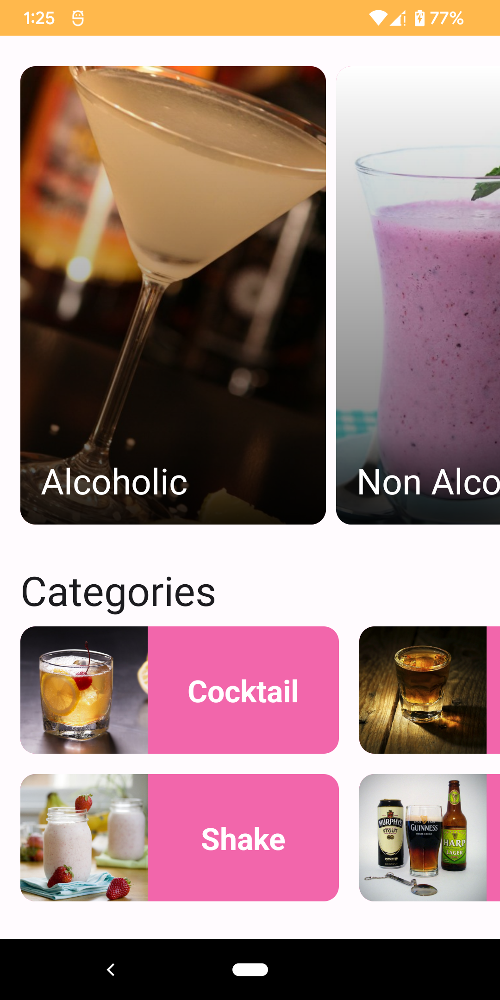
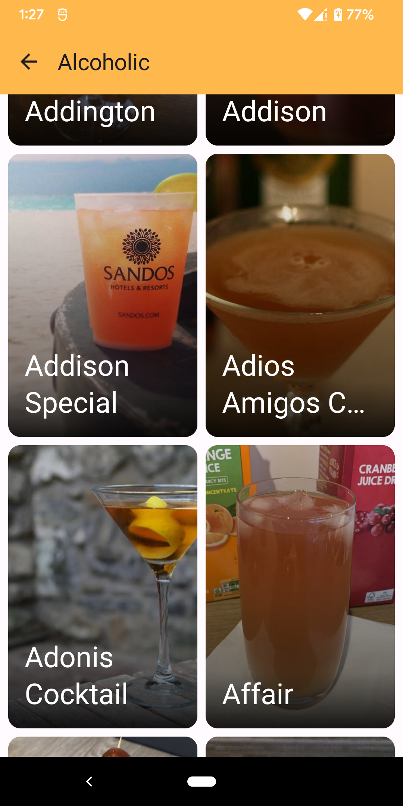
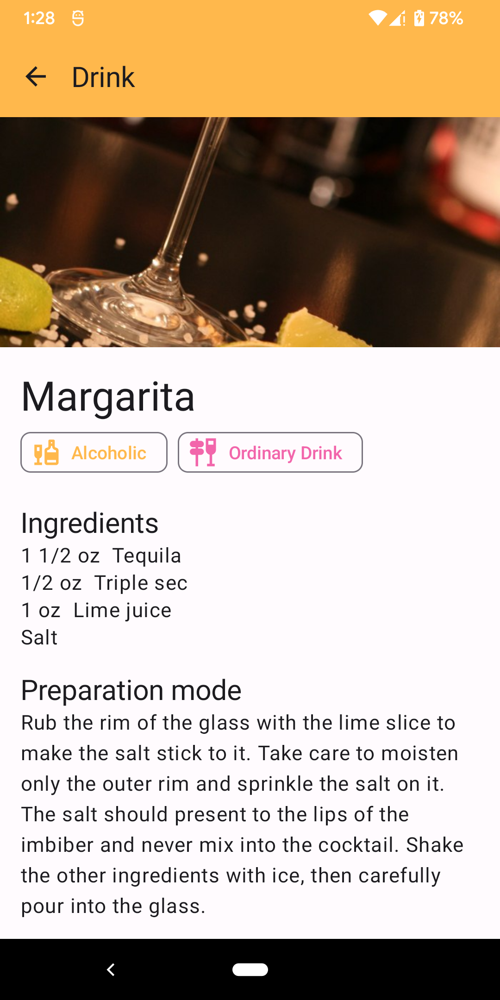

<a name="readme-top"></a>

<!-- PROJECT LOGO -->
<br />
<div align="center">
  <a href="#">
    
  </a>

  <h1 align="center">Drinks</h1>

  <p align="center">
    App to discover drinks.
  </p>
</div>

<!-- ABOUT THE PROJECT -->

## About The Project

The main goal of this app is to improve my development skills. The content is about drinks, so the data is taken from [TheCocktailDB](https://www.thecocktaildb.com/).

- `HomeScreen` shows filters like Alcohol, Categories and Ingredients. _The content is static for now_.
  <p></img></p>

- `FilterScreen` shows drinks filtered by alcohol content, ingredient or category.
  <p></img></p>

- `DrinkScreen` shows drink details like image, tags, ingredients and preparation steps.

  When users click on any tag (Alcoholic and Category types) they are taken to the `FilterScreen` again to see the drinks filtered by this tag.
  <p></img></p>

<p align="right">(<a href="#readme-top">back to top</a>)</p>

### Built With

- [Gradle v1.8](https://developer.android.com/build/releases/gradle-plugin#8-1-0)
- [Java 17](https://formulae.brew.sh/formula/openjdk@17)
- [Kotlin v1.8.10](https://kotlinlang.org/)
- [Android 14 (API level 34)](https://developer.android.com/tools/releases/platforms#14)
- [Android Studio Giraffe](https://developer.android.com/studio)

<p align="right">(<a href="#readme-top">back to top</a>)</p>

### Core dependencies

- [Jetpack Compose](https://developer.android.com/jetpack/compose) a modern toolkit for building native UI
- [Dagger Hilt](https://dagger.dev/hilt/) for dependency injection
- [Material Design 3](https://m3.material.io/develop/android/jetpack-compose) to met best practices of user interface design
- [git-crypt](https://github.com/AGWA/git-crypt) to enable transparent encryption and decryption of files
- [Sandwich](https://github.com/skydoves/sandwich) for handling API responses and exceptions
- [Retrofit](https://square.github.io/retrofit/) to configure an HTTP client
- [Kotlin Flows](https://kotlinlang.org/api/kotlinx.coroutines/kotlinx-coroutines-core/kotlinx.coroutines.flow/-flow/) for asynchronous data streams
- [App Distribution](https://firebase.google.com/docs/app-distribution/android/distribute-gradle) to distribute app versions painless

<!-- GETTING STARTED -->

## Getting Started

To get a local copy up and running follow these simple example steps.

### Prerequisites

1. Setup [commit signature verification](https://docs.github.com/en/authentication/managing-commit-signature-verification/about-commit-signature-verification)
2. Ask to the codeowners for adding you as collaborator on git-crypt config

### Installation

1. Clone the repo
   ```sh
   git clone https://github.com/pereyrarg11/Drinks.git
   ```
2. Unlock (decrypt) the repo
   ```sh
   git-crypt unlock
   ```

<p align="right">(<a href="#readme-top">back to top</a>)</p>

<!-- ROADMAP -->

## Roadmap

- [ ] Add `FavoritesScreen`
- [ ] Add offline mode
- [ ] Implement [In-app updates](https://developer.android.com/guide/playcore/in-app-updates)
- [ ] Get `HomeScreen` content from [Firebase Remote Config](https://firebase.google.com/docs/remote-config)
- [ ] Translate Drink instructions dynamically with [DeepL API](https://www.deepl.com/en/docs-api)
- [ ] Social log-in through [Firebase Auth](https://firebase.google.com/docs/auth)

<p align="right">(<a href="#readme-top">back to top</a>)</p>

<!-- CONTRIBUTING -->

## Contributing

Contributions are what make the open source community such an amazing place to learn, inspire, and create. Any contributions you make are **greatly appreciated**.

If you have a suggestion that would make this better, please fork the repo and create a pull request. You can also simply open an issue with the tag "enhancement".
Don't forget to give the project a star! Thanks again!

1. Fork the Project
2. Create your Feature Branch (`git checkout -b feature/amazing-feature`)
3. Commit your Changes (`git commit -m 'Add some Amazing Feature'`)
4. Push to the Branch (`git push origin feature/amazing-feature`)
5. Open a Pull Request

<p align="right">(<a href="#readme-top">back to top</a>)</p>

<!-- CONTACT -->

## Contact

Gabriel Pereyra - [pereyrarg11](https://pereyrarg11.com/) - gabriel@pereyrarg11.com

Project Link: [https://github.com/pereyrarg11/Drinks](https://github.com/pereyrarg11/Drinks)

<p align="right">(<a href="#readme-top">back to top</a>)</p>

<!-- ACKNOWLEDGMENTS -->

## Acknowledgments

Resources I find helpful and would like to give credit to.

- [TheCocktailDB](https://www.thecocktaildb.com/)
- [Detekt](https://detekt.dev/)
- [Sandwich](https://github.com/skydoves/sandwich)
- [git-crypt](https://github.com/AGWA/git-crypt)
- [JSONView](https://chromewebstore.google.com/detail/jsonview/gmegofmjomhknnokphhckolhcffdaihd)
- [JSON Editor Online](https://jsoneditoronline.org/)
- [Tinypng](https://tinypng.com/)

<p align="right">(<a href="#readme-top">back to top</a>)</p>
